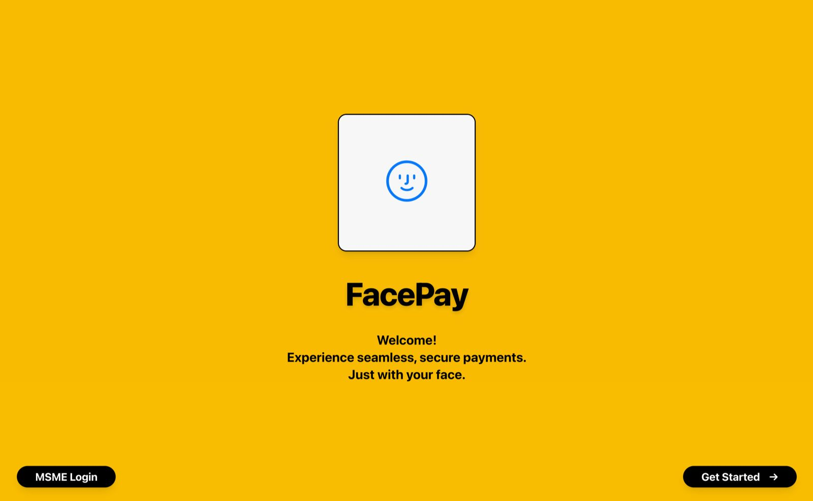

# FacePay – AI-Powered Facial Recognition Payment Platform



## Important Links

- [FacePay Mobile App](https://github.com/xx-3-xx/FacePayMobileApp)
- [FacePay Merchant (MSME) Web Portal](https://github.com/thanir03/facepay-msme)
- [Pitch Deck](./public/assets/Payhack2025-FacePay-pitchdeck.pdf)

---

## Why It's Critical

FacePay solves a pressing need for **secure, touchless, and frictionless payments** by enabling **on-device facial recognition** that is private by design. Built specifically for **MSMEs**, it brings enterprise-grade biometric payment technology to small businesses at an accessible price point.

- 🧾 **Merchant Web Portal** – For MSMEs to onboard, manage business profiles, and accept payments
- 📱 **Mobile App** – For consumers to authenticate identity and make payments using face recognition

---

## How It Works

## 🛠 Tech Stack

| Layer              | Technologies                                                                |
| ------------------ | --------------------------------------------------------------------------- |
| Frontend           | **Next.js**, **React**, **Tailwind CSS**, **Framer Motion**                 |
| Facial Recognition | **MediaPipe Tasks Vision**, **TensorFlow.js**, **Face Landmarks Detection** |
| Webcam Access      | `react-webcam`                                                              |
| Notifications      | `web-push`, Push API, Firebase Cloud Messaging                              |
| Local SSL (Dev)    | `mkcert` for self-signed HTTPS                                              |
| Backend (optional) | **Node.js**, **Express** (for HTTPS server)                                 |

---

## Key Features

### 🧾 FacePayMerchant (Merchant Portal)

| Feature                           | Description                                                                          |
| --------------------------------- | ------------------------------------------------------------------------------------ |
| **Real-Time Face Authentication** | Uses MediaPipe & TensorFlow.js to perform fast, secure facial recognition on-device. |
| **Webcam Integration**            | Accesses the user's device camera via `react-webcam` with fallback logic.            |
| **Merchant Onboarding**           | Simple UI for MSMEs to register, configure, and activate FacePay services.           |
| **Transaction Analytics**         | View real-time transaction volumes, customer data, and usage history.                |
| **Accept Face based Payments**    | Enable seamless allowing customers to pay using facial recognition without phones    |

### 📱 FacePayMobileApp (Consumer)

| Feature                           | Description                                                                          |
| --------------------------------- | ------------------------------------------------------------------------------------ |
| **Real-Time Face Authentication** | Uses MediaPipe & TensorFlow.js to perform fast, secure facial recognition on-device. |
| **Webcam Integration**            | Accesses the user's device camera via `react-webcam` with fallback logic.            |
| **3D Card Display UI**            | Smooth and modern visual card representation using `framer-motion`.                  |
| **Local Data Storage**            | Stores non-sensitive user data and preferences locally for performance.              |
| **Privacy-First Architecture**    | All facial detection is performed on-device, with zero facial image uploads.         |

---

## 💼 Business Model

Our monetization is based on a **tiered subscription model** tailored to MSME needs:

| Plan    | Monthly Fee | Free Transaction Volume | Excess Fee |
| ------- | ----------- | ----------------------- | ---------- |
| Starter | RM39        | RM10,000                | 2.0%       |
| Growth  | RM99        | RM30,000                | 2.0%       |
| Pro     | RM299       | RM100,000               | 2.0%       |

> 💳 Beyond the free transaction volume, a flat 2.0% fee is applied.

---

## 🤝 Referral Program

To accelerate adoption, we offer a **referral program**:

- ✅ Merchants and consumers can invite others via referral links or codes
- 🎁 Earn discounts, bonus transaction credits, or cash rewards
- 🧾 Rewards are automatically applied once referrals complete onboarding

---

## Why It's a Win

- **Frictionless Payments**: No need for cash, cards, or phones—customers pay with just a **smile**.
- **Faster Checkout**: Speeds up **in-store transactions** and reduces queues.
- **Enhanced Security**: Face-based authentication lowers **fraud risk** and ensures identity accuracy.
- **Modern Experience**: Offers a cutting-edge, contactless payment method your customers will love.
- **Customer Loyalty**: A seamless experience boosts satisfaction and encourages repeat visits.

---

## Technical Architecture

### Core Components

1. **FacePay MSME app**: Handle onboarding for MSME to register their business to accept payments via face from customers
2. **FacePay Mobile app**: Handle user account registration and multiple bank accounts, e-wallets and cards integration
3. **FacePay Backend Server**: Handle all the transaction with the integration with Paynet API and face recognition based transactions
4. **MongoDB Database** : Single source of truth for all the transactions and account details & Store Faces into embeddings format using vector store
5. **ResNet100 Model** : To accurately detect faces

### Transaction Flow with FacePay

1. **Initiate Payment Request**

   - Merchant launches the payment scanner on the FacePay MSME app.
   - User is prompted to stand in front of the camera.

2. **Capture Live Face**

   - App captures the user's live face image or short video using the device camera.

3. **Liveliness Detection**

   - Liveliness check is performed to ensure the face is real (e.g., blink detection, head movement).
   - Prevents spoofing using photos or masks.

4. **Generate Live Face Embeddings**

   - The live face image is converted into a face embedding (numerical vector).

5. **Match with Stored Embeddings**

   - The embedding is compared against all registered consumer embeddings in the vector database.
   - If similarity score is above threshold (e.g., cosine similarity ≥ 0.8), it's a valid match.

6. **Retrieve Consumer Account**

   - Based on matched embedding, the user's account ID and linked registered account details are retrieved.

7. **Process Payment**

   - Deduct the specified transaction amount from the user’s selected account.
   - Log the transaction (merchant ID, user ID, amount, timestamp).

8. **Send Confirmation**
   - Backend responds with transaction status (success or failure).
   - Merchant app displays "Payment Successful" or relevant error message.
   - Consumer receives a push notification of the transaction status.

---

## 🔒 Security Considerations

1. **Access Control**

   - **Face authentication** must be tied to **verified user accounts** via **eKYC (MyKad, Face)**.
   - Only **authorized merchants/devices** can initiate **face scan requests**.
   - Secure **device registration** to prevent rogue **POS terminals**.

2. **Biometric Security**

   - Use **anti-spoofing (liveness detection)** techniques to prevent replay or photo attacks.
   - **Facial embeddings** are generated on-device and verified securely.
   - Check more than **100+ facial points** to verify user.

3. **Data Integrity**

   - Face match and transaction logs are **signed** and timestamped to ensure auditability.
   - Device-to-server communication uses HTTPS with mutual TLS (mTLS) for integrity.

4. **Privacy**

   - Facial data is hashed and **stored securely** using **encryption-at-rest (AES-256)**.
   - Only **authorized services** can access facial embeddings through scoped tokens.

5. **Payment Authorization**

   - Face match alone is not sufficient; Biometric reconfirmation is required for large transactions.
   - Users are notified in real-time for each face-based payment.

6. **Device Security**

   - Edge devices (camera-enabled POS systems) are **locked down with kiosk mode** and remote kill switch.
   - **Device tamper detection** and logging are in place.

7. **Compliance**

   - Follows **PDPA (Malaysia), GDPR (EU)**, and other relevant biometric privacy laws.
   - User consent is **mandatory** before enrollment and each biometric transaction.

---

## 🧪 Local Development Setup

### ✅ Requirements

- Node.js 18+
- npm 9+
- Git
- Chrome or Edge browser (for webcam & push API testing)
- [mkcert](https://github.com/FiloSottile/mkcert) for local HTTPS (optional but recommended)

### Run FacePay MSME Mobile Application

1. **Clone Repository**:

   ```
   git clone https://github.com/thanir03/facepay-msme.git
   ```

2. **Install Dependencies**:

   ```
   pnpm install
   ```

3. **Run FacePay MSME App**:

   ```
   pnpm dev
   ```

4. **Open app at https://localhost:4000**

---

### Run FacePay Consumer Mobile Application

1. **Clone Repository**:

   ```
   git clone https://github.com/xx-3-xx/FacePayMobileApp
   ```

2. **Install Dependencies**:

   ```
   pnpm install
   ```

3. **Run FacePay Consumer App**:

   ```
   pnpm dev
   ```

4. **Open app at https://localhost:3000**

---

## Contact and Support

- **GitHub**: Report issues at <https://github.com/thanir03/facepay-msme>.
- **Email**: Contact <2003thanir10@gmail.com> for inquiries.

> Pay with your face. No phone. No card. No cash. Just smile
